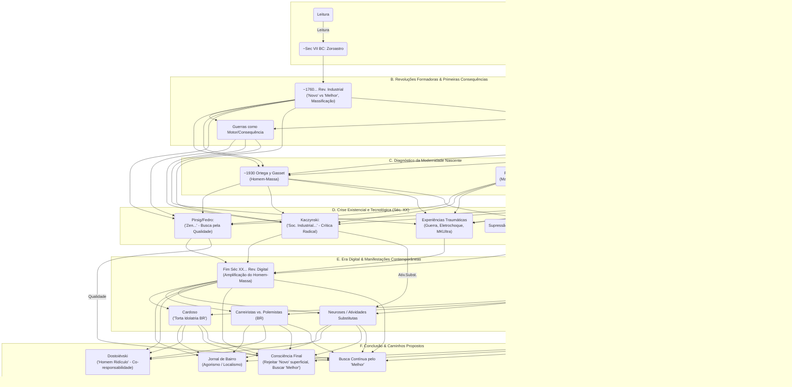

# Mapeamento Filosófico e Histórico da Crítica à Modernidade

Este repositório contém um mapeamento abrangente de correntes filosóficas, pensadores e conceitos relacionados à crítica da modernidade, abrangendo desde precursores antigos até manifestações contemporâneas. O objetivo é fornecer uma ferramenta de navegação conceitual para compreender as interconexões entre diferentes críticos da modernidade, suas experiências pessoais e contribuições teóricas.

## Sumário

1. [Fluxo Histórico e Conceitual](#fluxo-histórico-e-conceitual)
2. [Índice Remissivo](#índice-remissivo)
3. [Índice Remissivo Cruzado](#índice-remissivo-cruzado)
4. [Dimensões Biográficas: Sanidade e Gênio](#dimensões-biográficas-sanidade-e-gênio)
5. [Dimensões Conspiratórias](#dimensões-conspiratórias)

---

## Fluxo Histórico e Conceitual

O diagrama abaixo apresenta um mapeamento visual das relações entre pensadores, eventos históricos e conceitos filosóficos críticos da modernidade, organizados em seis categorias principais.

### Interpretação do Fluxo

Este diagrama mapeia a evolução histórica da crítica à modernidade, desde seus precursores mais antigos como Zoroastro até manifestações contemporâneas. As setas representam influências diretas e indiretas, enquanto os agrupamentos identificam períodos e temas centrais.

O fluxo ilustra como as revoluções industrial e francesa estabeleceram promessas que, ao falharem, geraram crises existenciais e tecnológicas. Estas, por sua vez, se manifestam na era digital contemporânea através de fenômenos como a amplificação do homem-massa e o surgimento de atividades substitutas para necessidades humanas fundamentais.

---

## Índice Remissivo

### Pensadores e Conceitos Principais

* **Alves, Rubem:**
   * *Tom geral:* Sensibilidade poética, foco no cotidiano, simplicidade, perda do encanto.
   * *O que é Religião:* Exploração da religiosidade como dimensão essencial da experiência humana além das instituições.
   * *Variações Sobre o Prazer:* Defesa do prazer como experiência legítima e necessária contra o utilitarismo moderno.

* **Bonaparte, Napoleão:**
   * Importância da leitura ("homem que não lê").
   * Ciclo de 360º das revoluções (troca de tiranias).
   * Poder da imaginação e das narrativas.
   * *Revolução como usurpação:* Figura emblemática da transformação de ideais revolucionários em poder autoritário.
   * *Código Napoleônico:* Paradoxo da institucionalização de ideais revolucionários em estruturas tradicionais.

* **Burke, Edmund:**
   * *Reflexões sobre a Revolução na França:* Crítica premonitória aos excessos revolucionários.
   * *Conservadorismo prudencial:* Defesa da prudência nas mudanças sociais e da sabedoria contida nas tradições.
   * *Contrato social transgeracional:* Conceito de sociedade como parceria entre vivos, mortos e os que ainda não nasceram.
   * *Crítica do racionalismo abstrato:* Rejeição da aplicação de teorias abstratas sem consideração às circunstâncias históricas e culturais.

* **Cardoso, Pedro:**
   * "Torta idolatria" brasileira (fascismo cordial).
   * *Crítica ao academicismo vazio:* Denúncia da substituição do pensamento genuíno por credencialismo.
   * *Falsa sofisticação intelectual:* Análise da preferência por complexidade obscura em detrimento da clareza.
   * *Paradoxo brasileiro:* Tensão entre subserviência intelectual e arrogância provincial.

* **Carvalho, Olavo de:**
   * *O Jardim das Aflições:* Crítica à utopia moderna como negação da realidade e geradora de novas tiranias.
   * *Imbecil Coletivo:* Análise da degradação do pensamento nas instituições acadêmicas e culturais brasileiras.
   * *Conceito de angelismo revolucionário:* Crítica à pretensão de perfeição moral dos movimentos revolucionários.
   * *Dialética da desmoralização:* Processo pelo qual críticos da ordem estabelecida são sistematicamente desacreditados.
   * *Meta-narrativa da revolução:* Identificação do fio condutor revolucionário presente em diversos movimentos aparentemente distintos.

* **Chesterton, G.K.:**
   * "Príncipe dos Paradoxos": Uso do paradoxo como ferramenta de pensamento.
   * Defensor da tradição, paradoxos, e ortodoxia cristã através de estilo literário marcante.
   * *Ortodoxia:* Defesa da tradição cristã como a mais radical e revolucionária das visões de mundo.
   * *O homem eterno:* Visão da história centrada na encarnação de Cristo como evento divisor.
   * *Distributismo:* Crítica tanto ao capitalismo quanto ao socialismo em favor de uma economia baseada na propriedade amplamente distribuída.

* **Corção, Gustavo:**
   * Exemplo de polemista honesto e contundente do passado.
   * "O Chesterton brasileiro": Tese defendida pela semelhança em estilo argumentativo, defesa da tradição católica, uso de paradoxos, e crítica à modernidade superficial.
   * *A Descoberta do Outro:* Obra autobiográfica sobre sua conversão ao catolicismo e descoberta da alteridade.
   * *Fronteiras da Técnica:* Crítica pioneira no Brasil sobre os limites morais da tecnologia.
   * *Patriotismo e Nacionalismo:* Distinção crucial entre amor à pátria concreta (patriotismo) e idolatria da nação abstrata (nacionalismo).

* **Dostoiévski, Fiódor:**
   * "Se Deus está morto, tudo é permitido" (implicações da ausência de limites morais).
   * *Sonho de um Homem Ridículo:* Consciência da corresponsabilidade pelo mal no mundo.
   * *Os Demônios:* Retrato profético da psicologia revolucionária e suas consequências niilistas.
   * *Homem do Subsolo:* Crítica ao racionalismo e utilitarismo modernos através da psicologia do ressentimento.
   * *O Grande Inquisidor:* Parábola sobre a tentação de trocar a liberdade pela segurança material.
   * *Integração da sombra:* Reconhecimento da própria capacidade para o mal como condição para a autenticidade moral.

* **Kaczynski, Theodore (Ted / Unabomber):**
   * *A Sociedade Industrial e Seu Futuro (Manifesto):* Crítica radical à tecnologia, "processo de poder", "atividades substitutas".
   * Gênio da matemática, dificuldades sociais, experiência com MKUltra.
   * A caçada mais longa do FBI (1978-1996): Capturado ironicamente através de análise linguística de seu manifesto - o crítico da tecnologia moderna identificado por análise tecnológica de padrões linguísticos únicos que seu irmão reconheceu.
   * *Conceito de "processo de poder":* Necessidade humana fundamental de autonomia e controle sobre condições imediatas da vida.
   * *Teoria das "atividades substitutas":* Análise de como a sociedade industrial canaliza impulsos humanos fundamentais para atividades triviais ou destrutivas.
   * *Distinção entre poder pessoal e poder organizacional:* Crítica à transferência de poder do indivíduo para sistemas tecnológicos e burocráticos.
   * *Crítica do "esquerdismo":* Análise psicológica da política de esquerda como expressão de sentimentos de inferioridade e hiper-socialização.

* **Montaigne, Michel de:**
   * *Ensaios:* Método de autoexame e reflexão como ponto de partida da escrita.
   * *Ceticismo moderado:* Questionamento da capacidade humana de conhecimento absoluto sem cair no niilismo.
   * *Relativismo cultural:* Pioneiro na comparação entre culturas europeias e não-europeias sem hierarquização.
   * *"Que sais-je?":* Atitude filosófica baseada na pergunta "O que sei eu?" como antídoto à arrogância intelectual.
   * *Autoexame constante:* Prática da introspecção rigorosa como método filosófico e moral.
   * *Ensaio como forma literária:* Invenção de nova forma de expressão filosófica, pessoal e assistemática, contra o tratado escolástico.

* **Nietzsche, Friedrich:**
   * *Assim Falou Zaratustra:* Apropriação irônica do nome de Zoroastro (Zaratustra) para proclamar a "morte de Deus" e a transvaloração dos valores - inversão provocativa do legado do Zoroastro histórico.
   * *Individualismo radical:* Defesa do "espírito livre" e do "além-do-homem" contra a massificação moderna (paralelo com críticas de Ortega y Gasset).
   * *Crítica da razão iluminista:* Rejeição do racionalismo como insuficiente para compreender a totalidade da experiência humana.
   * *Visão dionisíaca vs. apolínea:* Tensão entre impulsos criativos/caóticos e ordenadores/estruturantes (correlação com a "Qualidade" de Pirsig).
   * *Vontade de Potência:* Conceito de força criativa primordial que antecipa aspectos da "Qualidade dinâmica" de Pirsig.
   * *Crítica do ressentimento:* Análise da psicologia do ressentimento como base da moral moderna (paralelo com Dostoiévski).
   * *Perspectivismo epistemológico:* Rejeição de verdades absolutas em favor da multiplicidade necessária de perspectivas (antecipando Ortega).

* **Ortega y Gasset, José:**
   * *A Rebelião das Massas:* Conceito de "homem-massa" (mentalidade, não classe).
   * *Razão vital:* Filosofia que integra razão e experiência vivida contra o racionalismo abstrato.
   * *"Eu sou eu e minha circunstância":* Visão da existência humana como inseparável de seu contexto histórico e cultural.
   * *Perspectivismo:* Teoria do conhecimento baseada na multiplicidade necessária de perspectivas.
   * *Distinção entre ideias e crenças:* Análise da diferença entre pensamentos conscientes e pressupostos fundamentais.
   * *Geração como conceito histórico:* Compreensão da história através da sucessão de sensibilidades geracionais distintas.
   * *Crítica da especialização:* Denúncia do "bárbaro especialista" como figura típica da modernidade tardia.

* **Pirsig, Robert M.:**
   * *Zen e a Arte da Manutenção de Motocicletas:* Busca pela "Qualidade", alter-ego Fedro, Metafísica da Qualidade (MdQ), crítica à dicotomia sujeito-objeto.
   * Gênio da filosofia, experiência na Guerra da Coreia, tratamento psiquiátrico (eletrochoques), dificuldade profissional pós-sucesso, tragédia familiar (morte de Chris).
   * *Metafísica da Qualidade (MdQ):* Sistema filosófico que coloca a Qualidade como realidade primária, anterior à divisão sujeito-objeto.
   * *Padrões estáticos vs. dinâmicos:* Tensão necessária entre estabilidade e mudança no desenvolvimento cultural.
   * *Crítica da filosofia acadêmica:* Rejeição do profissionalismo filosófico em favor da filosofia como modo de vida.
   * *Viagem como metáfora filosófica:* Uso da jornada física como expressão da busca filosófica interna.
   * *Integração entre tecnologia e contemplação:* Rejeição da falsa dicotomia entre pensamento técnico e humanístico.

* **Zoroastro:**
   * Referência como marco inicial da história filosófica documentada (contextualizando "história recente").
   * *Dualismo ético:* Introdução da concepção de conflito cósmico entre bem e mal na história do pensamento.
   * *Livre-arbítrio:* Ênfase na escolha moral como centro da existência humana.
   * *Escatologia:* Desenvolvimento da visão linear da história culminando em julgamento final.
   * *Monoteísmo ético:* Transição do politeísmo naturalista para um monoteísmo centrado na conduta moral.
   * *Influência no Ocidente:* Impacto fundamental nas tradições abraâmicas (judaísmo, cristianismo, islamismo) e na filosofia grega.

### Metáforas Recorrentes

* **Jardins (Metáfora Recorrente):**
   * *Jardim do Éden (Gênesis):* Origem arquetípica - paraíso perdido pela desobediência e busca de conhecimento.
   * *Jardim prometido (Revolução Francesa):* Utopia terrena que prometia retornar ao estado edênico através da razão e revolução.
   * *Jardim das Aflições (Olavo de Carvalho):* Crítica à utopia moderna como inversão do Éden - a aflição gerada pela promessa impossível do paraíso terreno.
   * *Jardim dos Espinhos Florescentes:* O jardim do real absoluto - onde a beleza e o florescimento existem não apesar dos espinhos, mas em harmonia com eles. Metáfora para a aceitação da realidade integral, com suas imperfeições e potencialidades, que supera tanto a nostalgia edênica quanto as promessas utópicas.

---

## Índice Remissivo Cruzado

### 1. Crítica à Modernidade e Massificação
* **Ortega y Gasset ↔ Kaczynski ↔ Nietzsche**: 
  * O "homem-massa" (Ortega) como ser desarraigado que vive de "atividades substitutas" (Kaczynski) e manifesta o "último homem" nietzscheano.
  * Compreendem a modernidade como processo de nivelamento e despersonalização.

* **Carvalho ↔ Burke ↔ Corção**:
  * Crítica à revolução como destruição da organicidade social.
  * Defesa da tradição como sabedoria acumulada contra o racionalismo abstrato.

* **Cardoso ↔ Carvalho ↔ Corção**:
  * Análise da subserviência intelectual brasileira e sua correlação com o fenômeno global.
  * Crítica ao acadêmico como substituto do intelectual autêntico.

### 2. Busca pela Autenticidade e Autoconhecimento
* **Montaigne ↔ Pirsig ↔ Dostoiévski**:
  * O autoexame (Montaigne) como busca da "Qualidade" (Pirsig) e método para integrar o "subsolo" da psique (Dostoiévski).
  * A jornada pessoal como método filosófico.

* **Nietzsche ↔ Pirsig ↔ Dostoiévski**:
  * A tensão dionisíaco/apolíneo (Nietzsche) refletida na dialética entre Qualidade dinâmica/estática (Pirsig) e na luta entre impulso vital e racionalismo no "homem do subsolo" (Dostoiévski).
  * Rejeição da separação cartesiana entre sujeito e objeto.

* **Alves ↔ Pirsig**:
  * Busca pela dimensão poética e sensorial da experiência contra a mecanização da vida.
  * Valorização do cotidiano como espaço de transcendência.

### 3. O Problema da Utopia e da Revolução
* **Burke ↔ Carvalho ↔ Dostoiévski**:
  * A crítica à Revolução Francesa como promessa utópica que conduz ao terror.
  * "Os Demônios" (Dostoiévski) como retrato psicológico que confirma as previsões de Burke e fundamenta a crítica olaviana do "jardim das aflições".

* **Napoleão ↔ Carvalho**:
  * O ciclo de 360° das revoluções: da promessa de liberdade ao retorno da tirania.
  * A instrumentalização do idealismo revolucionário para fins de poder.

* **Kaczynski ↔ Carvalho ↔ Dostoiévski**:
  * Análise psicológica da mentalidade revolucionária: ressentimento e busca de poder.
  * Rejeição da utopia tecnológica (Kaczynski) e da utopia política (Carvalho/Dostoiévski) como formas do mesmo impulso.

### 4. Metafísica e Espiritualidade na Era Moderna
* **Pirsig ↔ Nietzsche ↔ Zoroastro**:
  * A "Qualidade" (Pirsig) como reconstrução da "vontade de potência" (Nietzsche) e retorno ao dualismo ético (Zoroastro).
  * Busca por uma espiritualidade que transcende o materialismo sem retornar ao dogmatismo.

* **Dostoiévski ↔ Carvalho ↔ Alves**:
  * A crítica ao "Se Deus está morto, tudo é permitido" como diagnóstico da crise moral moderna.
  * Busca por um fundamento transcendente para a ética na era pós-iluminista.

* **Chesterton ↔ Corção ↔ Dostoiévski**:
  * Ortodoxia cristã como resposta paradoxal (não reacionária) à modernidade.
  * Visão da tradição como fonte de vitalidade, não apenas conservação.

### 5. Metodologias de Pensamento
* **Montaigne ↔ Chesterton ↔ Corção**:
  * O ensaio pessoal (Montaigne) e o paradoxo (Chesterton/Corção) como métodos alternativos ao tratado sistemático.
  * Valorização da experiência concreta sobre a abstração.

* **Ortega ↔ Nietzsche ↔ Pirsig**:
  * Perspectivismo e rejeição da verdade absoluta como método de conhecimento.
  * Integração entre razão e experiência vital ("razão vital" em Ortega, elementos dionisíacos em Nietzsche, Qualidade em Pirsig).

* **Burke ↔ Corção ↔ Carvalho**:
  * Prudência como virtude intelectual contra o racionalismo abstrato.
  * História como repositório de sabedoria contra a utopia revolucionária.

### 6. Tecnologia e Alienação
* **Kaczynski ↔ Pirsig ↔ Corção**:
  * Crítica radical à tecnologia (Kaczynski) versus busca de reconciliação entre técnica e humanismo (Pirsig/Corção).
  * Diagnóstico comum: tecnologia moderna como alienante quando divorciada de valores humanos fundamentais.

* **Ortega ↔ Kaczynski**:
  * O "bárbaro especialista" (Ortega) como produto da fragmentação do conhecimento que Kaczynski identifica no processo industrial.
  * Crítica compartilhada à perda da visão holística do mundo.

### 7. Crítica à Linguagem e Comunicação
* **Cardoso ↔ Orwell (implícito nas referências)**:
  * Análise da degradação da linguagem como instrumento de poder e confusão intelectual.
  * "Torta idolatria" brasileira como manifestação local da novilíngua orwelliana.

* **Carvalho ↔ Kaczynski ↔ Cardoso**:
  * Identificação de mecanismos de cooptação e neutralização do discurso crítico.
  * "Dialética da desmoralização" (Carvalho) como processo paralelo à análise da psicologia esquerdista (Kaczynski).

### 8. A Metáfora do Jardim
* **Gênesis ↔ Revolução Francesa ↔ Carvalho ↔ "Jardim dos Espinhos Florescentes"**:
  * Evolução do símbolo: de paraíso perdido (Gênesis) à utopia revolucionária (França) à crítica da utopia (Carvalho) à síntese realista-transcendente ("Espinhos Florescentes").
  * Jardim como metáfora central da condição humana e sua relação com a realidade e o ideal.

* **Burke ↔ Carvalho**:
  * Crítica à tentativa de criar o paraíso na terra como fonte de novas tiranias.
  * Defesa da imperfeição necessária do mundo contra o perfeccionismo revolucionário.

### 9. Individualismo e Comunidade
* **Kaczynski ↔ Nietzsche ↔ Dostoiévski**:
  * Tensão entre afirmação radical do indivíduo e reconhecimento da necessidade de comunidade.
  * Kaczynski como exemplo do fracasso do individualismo radical nietzscheano quando desprovido da dimensão comunitária dostoievskiana.

* **Burke ↔ Chesterton ↔ Corção**:
  * Visão orgânica da sociedade como comunidade transgeracional contra individualismo abstrato.
  * "Contrato entre vivos, mortos e os que ainda não nasceram" (Burke) como base para um comunitarismo não-coletivista.

### 10. O Problema da Leitura e Formação
* **Napoleão ↔ Ortega ↔ Carvalho**:
  * A importância da leitura profunda versus informação superficial.
  * Relação entre leitura, poder e capacidade de resistência intelectual.

* **Montaigne ↔ Pirsig ↔ Dostoiévski**:
  * Leitura como autoexame e processo existencial, não apenas acúmulo de informação.
  * Literatura como método filosófico alternativo ao tratado acadêmico.

---

## Dimensões Biográficas: Sanidade e Gênio

### Nietzsche ↔ Pirsig
* **Conexão conceitual:** Ambos buscaram transcender a dicotomia sujeito-objeto e criticaram o racionalismo ocidental.
* **Experiências psiquiátricas:** 
  * Nietzsche sofreu colapso mental em 1889 em Turim, permanecendo em estado catatônico/confusional por 11 anos até sua morte.
  * Pirsig foi internado e submetido a 28 sessões de eletrochoques, perdendo parte de suas memórias.
* **Diagnósticos:**
  * Nietzsche: Diagnósticos variaram de paralisia geral progressiva (sífilis terciária) a transtorno bipolar. Seu colapso envolveu abraçar um cavalo sendo açoitado em Turim.
  * Pirsig: Diagnosticado com esquizofrenia paranoide e depressão clínica. Desenvolveu o alter-ego "Fedro" como personificação de seu eu pré-tratamento.
* **Influência na obra:**
  * A "loucura" de Nietzsche é frequentemente usada para desqualificar seu pensamento, embora sua produção intelectual tenha cessado após o colapso.
  * Pirsig integrou sua experiência psiquiátrica como tema central de "Zen", transformando sua fragmentação mental em método filosófico.

### Kaczynski ↔ Pirsig
* **Conexão conceitual:** Crítica à tecnologia moderna e busca por autenticidade.
* **Experiências psiquiátricas:**
  * Kaczynski: Sujeito a experimentos psicológicos controversos (MKUltra) em Harvard. Possível causa de danos psicológicos permanentes.
  * Pirsig: Tratamento psiquiátrico intensivo, incluindo eletrochoques que apagaram parte de sua memória.
* **Diagnósticos:**
  * Kaczynski: Diagnosticado com esquizofrenia paranoide durante seu julgamento, diagnóstico controverso e possivelmente estratégico para sua defesa.
  * Pirsig: Esquizofrenia e depressão, posteriormente questiona validade de seu próprio diagnóstico.
* **Influência na obra:**
  * Ambos transformaram suas experiências de alienação e tratamento psiquiátrico em críticas sistemáticas à sociedade tecnológica moderna.
  * Divergência fundamental: Pirsig buscou integração (entre tecnologia e valores), Kaczynski optou pela rejeição completa.

### Carvalho ↔ Nietzsche
* **Conexão conceitual:** Crítica à modernidade, rejeição do progressismo histórico.
* **Experiências psiquiátricas:**
  * Carvalho: Passou por internação psiquiátrica nos anos 1960, experiências com substâncias psicoativas e práticas esotéricas.
  * Nietzsche: Colapso mental em 1889, com progressiva deterioração até sua morte em 1900.
* **Diagnósticos:**
  * Carvalho: Não há diagnóstico público oficial, mas relatos de episódios depressivos e experiências de estados alterados de consciência, posteriormente integrados em sua visão filosófica.
  * Nietzsche: Múltiplos diagnósticos póstumos, desde sífilis neurovascular a transtorno bipolar.
* **Influência na obra:**
  * Ambos construíram filosofias que desafiam o consenso acadêmico a partir de experiências pessoais intensas.
  * Ambos tiveram suas ideias frequentemente desqualificadas com base em questões de saúde mental.

### Observações Gerais sobre Gênio e Diagnóstico

* O padrão recorrente de experiências psiquiátricas entre pensadores críticos da modernidade sugere uma correlação entre:
  1. A capacidade de perceber contradições fundamentais na civilização moderna
  2. A experiência de desajuste pessoal categorizada como "doença mental"

* A instrumentalização do diagnóstico psiquiátrico como forma de desqualificação de críticas à ordem estabelecida aparece em múltiplos casos (Nietzsche, Pirsig, Kaczynski, até certo ponto Carvalho).

* A transformação da experiência de fragmentação mental em método filosófico aparece como estratégia recorrente (Pirsig com Fedro, Dostoiévski com seus personagens, Nietzsche com seus heterônimos).

* Questionamento: Em que medida o diagnóstico psiquiátrico serve como instrumento de controle social/intelectual versus identificação legítima de sofrimento mental?

---

## Dimensões Conspiratórias

### Kaczynski ↔ Carvalho
* **Teorias que analisaram:**
  * Kaczynski: Desenvolveu tese sobre uma "conspiração" tecnocrática não-intencional - sistema autoperpetuante que avança independentemente de decisões individuais.
  * Carvalho: Propôs o conceito de "revolução gramsciana" - estratégia deliberada de transformação cultural antes da política.
* **Teorias sobre eles:**
  * Kaczynski: Vítima confirmada de experimentos MKUltra da CIA em Harvard (1958-1962); teorias sugerem que seus atos terroristas foram resultado direto destes experimentos.
  * Carvalho: Frequentemente acusado de promover teorias conspiratórias sobre "globalismo", "Foro de São Paulo", "marxismo cultural".
* **Relação com pensamento:**
  * Ambos desenvolveram metanarrativas sobre processos históricos ocultos, mas Kaczynski enfatizava sistemas autônomos enquanto Carvalho enfatizava agência humana deliberada.
  * A experiência real de Kaczynski com MKUltra influenciou sua desconfiança em instituições oficiais e tecnologia avançada.

### Nietzsche ↔ Burke
* **Teorias que analisaram:**
  * Nietzsche: Desenvolveu teoria sobre a "conspiração socrático-platônica" - suposto plano para substituir valores aristocráticos por racionalismo.
  * Burke: Sugeriu que a Revolução Francesa foi parcialmente orquestrada por sociedades secretas (maçonaria, Illuminati).
* **Teorias sobre eles:**
  * Nietzsche: Apropriação conspiratória pelo nazismo; teorias sobre envenenamento deliberado por médicos.
  * Burke: Acusado por revolucionários de conspirar contra a liberdade a serviço da aristocracia.
* **Relação com pensamento:**
  * Nietzsche via "conspirações" como operações culturais de longa duração, não necessariamente conscientes.
  * Burke identificava elementos conspiratórios reais, mas os subordinava a análises de forças históricas mais amplas.

### Análise Geral das Dimensões Conspiratórias

1. **Tipologia das teorias conspiratórias:**
   * **Conspirações estruturais/sistêmicas:** Não exigem coordenação consciente (Kaczynski, Nietzsche)
   * **Conspirações agenciais:** Envolvem atores deliberados com intenções ocultas (elementos em Carvalho, Burke)
   * **Meta-conspirações:** Teorias sobre porque certas teorias são rotuladas como "conspiratórias" (presente em vários autores)

2. **Experiência pessoal e teoria conspiratória:**
   * A vitimização real por instituições poderosas (Kaczynski com MKUltra, Dostoiévski com prisão política) frequentemente fundamenta análises que são rotuladas como "conspiratórias"
   * O padrão sugere que experiências reais de abuso institucional aumentam a propensão a identificar padrões sistemáticos de manipulação

3. **Acusação de "teoria da conspiração" como mecanismo de desqualificação:**
   * Praticamente todos os críticos radicais da modernidade são acusados de "conspiracionismo"
   * O rótulo frequentemente serve para evitar engajamento com a substância da crítica

4. **Validade epistêmica diferencial:**
   * Algumas teorias inicialmente rotuladas como "conspiratórias" foram posteriormente confirmadas (MKUltra, vigilância global)
   * O problema filosófico: como distinguir padrões reais de projeções paranoides sem acesso privilegiado à informação?

---

## Licença e Contribuições

Este mapeamento filosófico e histórico está em constante desenvolvimento. Contribuições são bem-vindas para expandir as conexões entre pensadores, adicionar novas perspectivas, ou aprofundar análises existentes.

Licenciado sob [Creative Commons Attribution-NonCommercial 4.0 International License](https://creativecommons.org/licenses/by-nc/4.0/).
