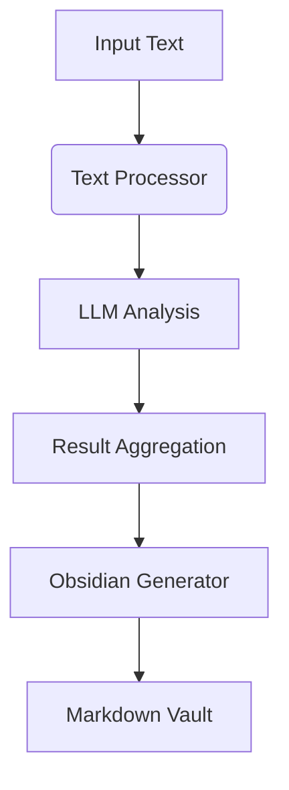

# Architecture Overview

## Core Components

### Text Processing Pipeline
- Text splitting and chunking
- Entity extraction
- Concept mapping
- Metaphor analysis
- Poetic elements detection
- Correlation analysis

### LLM Integration
- Provider abstraction layer
- Async API calls
- Response caching
- Deepseek implementation

### Obsidian Output
- Vault structure generation
- Markdown note templates
- Entity relationship mapping
- Automatic backlinking

## Data Flow

