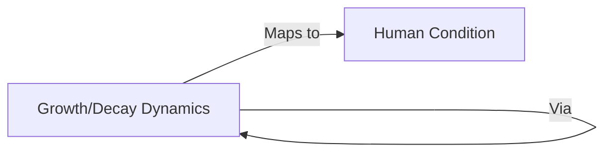

# Sample Analysis: Metaphorical Structures

## Example Output

### Metaphor Analysis


### Poetic Elements
**Sound Patterns**:
- Alliteration: "espinhos florescentes" → Creates rhythmic emphasis
- Assonance: "rosas mais belas" → Enhances aesthetic quality

**Imagery Analysis**:
| Type | Example | Function |
|------|---------|----------|
| Visual | "rosas mais belas" | Establishes beauty ideal |
| Tactile | "espinhos afiados" | Conveys danger/pain |

### Philosophical Evaluation
**Conceptual Strength**:
- Provides concrete grounding for abstract concepts
- Creates memorable epistemological framework

**Potential Issues**:
- May oversimplify moral complexity
- Risk of biological determinism
```
