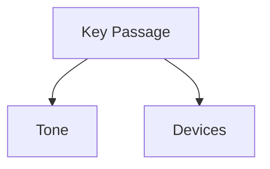

# Tone Analysis Prompt

## Purpose
Analyzes rhetorical style and philosophical tone in texts.

## Template Variables
- `{text}`: The input text to analyze
- `{lang}`: Language code (en/pt)
- `{options}`: Analysis options JSON

## Language-Specific Notes

### English (en)
- Focus on philosophical argumentation style
- Identify academic vs popular writing markers
- Note use of irony/sarcasm

### Portuguese (pt)
- Consider cultural context of Brazilian/Portuguese philosophical writing
- Note markers of oral tradition in written texts
- Pay attention to hybrid academic-popular styles common in Lusophone philosophy

## Example Usage
```python
from obsidian_analyzer.prompt_loader import load_prompt

prompt = load_prompt("analyze_tone", {
    "text": sample_text,
    "lang": "en"  # or "pt"
})
```

## Output Structure
```markdown
### Tone Assessment
**Dominant Tone**: [Descriptor]  
**Key Features**: 
- [Feature]: [Example] → [Analysis]

### Rhetorical Map


### Recommendations
- For Students: [Tips]
- For Critics: [Approaches]
```
