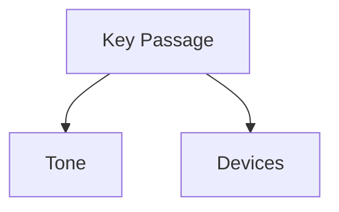
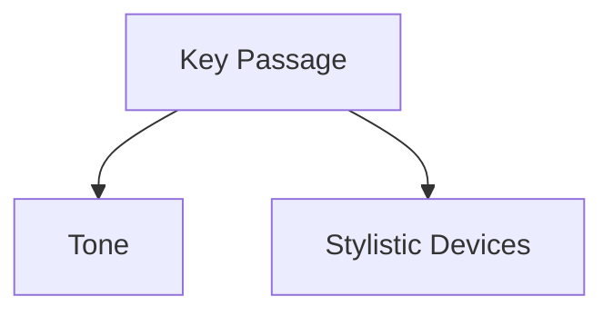

# Tone Analysis Prompt

## Purpose
Analyzes rhetorical style and philosophical tone in texts.

## Template Variables
- `{text}`: The input text to analyze
- `{lang}`: Language code (en/pt)
- `{options}`: Analysis options JSON

## Example Usage
```python
from obsidian_analyzer.prompt_loader import load_prompt

prompt = load_prompt("analyze_tone_en", {
    "text": sample_text,
    "lang": "en"
})
```

## Output Structure
```markdown
### Tone Assessment
**Dominant Tone**: [Descriptor]
**Key Features**: 
- [Feature]: [Example] → [Analysis]

### Rhetorical Map


### Recommendations
- For Students: [Tips]
- For Critics: [Approaches]
```

# Tone Analysis Prompt

## Purpose
Analyzes rhetorical style and philosophical tone in English texts.

## Template Variables
- `{text}`: Text to analyze
- `{lang}`: en
- `{options}`: Analysis options in JSON

## Example Usage
```python
from obsidian_analyzer.prompt_loader import load_prompt

prompt = load_prompt("analyze_tone_en", {
    "text": english_text,
    "lang": "en"
})
```

## Output Structure
```markdown
### Tone Assessment
**Dominant Tone**: [descriptor]
**Key Features**:
- [Feature]: [Example] → [Analysis]

### Rhetorical Map


### Recommendations
- For Students: [Tips]
- For Critics: [Approaches]
```

**Notes**:
- Focus on philosophical rather than purely linguistic analysis
- Consider academic vs popular writing markers
- Note use of irony/sarcasm
