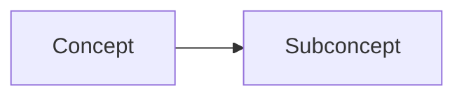

# Concept Mapping Prompt

## Purpose
Identifies and maps philosophical concepts and relationships in texts.

## Template Variables
- `{text}`: The input text  
- `{lang}`: Language code (en/pt)
- `{options}`: Analysis options JSON

## Language-Specific Notes

### English (en)
- Focus on Western philosophical terminology
- Standard academic concept mapping

### Portuguese (pt)
- Include Lusophone philosophical concepts
- Note Brazilian/Portuguese specific terminology
- Consider hybrid concepts from cultural anthropology

## Example Usage
```python
prompt = load_prompt("concepts_map", {
    "text": input_text,
    "lang": "pt"  # or "en"
})
```

## Output Structure
```markdown
### Concept Map


### Analytical Table
| Concept | Definition | Authors |
|---------|------------|---------|

### Glossary
**Term**: Definition
```
