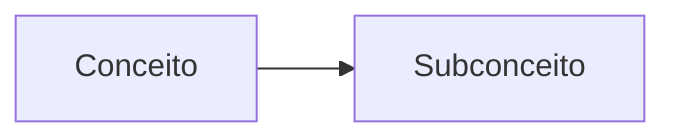

# Concept Mapping Prompt (Portuguese)

## Purpose
Maps philosophical concepts and relationships in Portuguese texts.

## Template Variables
- `{text}`: The input text to analyze  
- `{lang}`: Language code (pt)
- `{options}`: Analysis options JSON

## Example Usage
```python
prompt = load_prompt("concepts_map_pt", {
    "text": portuguese_text,
    "lang": "pt" 
})
```

## Output Structure
```markdown
### Mapa Conceitual


### Tabela Analítica
| Conceito | Definição | Autores |
|----------|-----------|---------|

### Glossário
**Termo**: Definição
```

# Mapeamento de Conceitos (Português)

## Propósito
Identifica e mapeia conceitos filosóficos em textos em português.

## Variáveis do Template
- `{text}`: Texto para análise
- `{lang}`: pt
- `{options}`: Opções de análise em JSON

## Exemplo de Uso
```python
from obsidian_analyzer.prompt_loader import load_prompt

prompt = load_prompt("concepts_map_pt", {
    "text": texto_em_portugues,
    "lang": "pt"
})
```

## Estrutura de Saída
```markdown
### Mapa Conceitual


### Tabela Analítica
| Conceito | Definição | Autores |
|----------|-----------|---------|

### Glossário
**Termo**: Definição
```

**Notas**:
- Incluir conceitos específicos da filosofia lusófona
- Considerar terminologia brasileira/portuguesa
- Identificar conceitos híbridos da antropologia cultural
