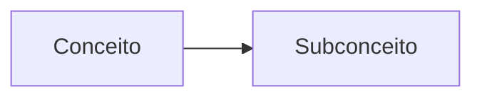

# Concept Mapping Prompt (Portuguese)

## Purpose
Maps philosophical concepts and relationships in Portuguese texts.

## Template Variables
- `{text}`: The input text to analyze  
- `{lang}`: Language code (pt)
- `{options}`: Analysis options JSON

## Example Usage
```python
prompt = load_prompt("concepts_map_pt", {
    "text": portuguese_text,
    "lang": "pt" 
})
```

## Output Structure
```markdown
### Mapa Conceitual


### Tabela Analítica
| Conceito | Definição | Autores |
|----------|-----------|---------|

### Glossário
**Termo**: Definição
```

[View Full Prompt Template](../../prompts/concepts_map_pt.prompt)
