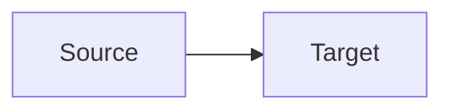

# Metaphor Analysis Prompt

## Purpose
Identifies and analyzes metaphorical structures in texts.

## Template Variables  
- `{text}`: Input text
- `{lang}`: Language code
- `{options}`: Analysis options

## Example Usage
```python
prompt = load_prompt("metaphor_analysis_en", {
    "text": poetic_text,
    "lang": "en"
})
```

## Output Structure
```markdown
### Key Metaphors  


### Poetic Analysis
- [Device]: [Example] → [Effect]

### Evaluation
**Strengths**:
- [Conceptual clarity]
```

[View Full Prompt Template](../../prompts/metaphor_analysis_en.md)
