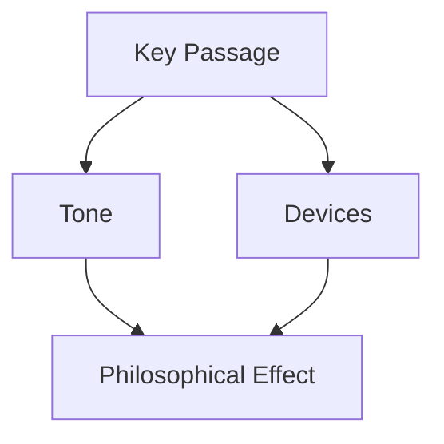

# Philosophical Tone Analysis (Enhanced)

**Objective:** Perform a deep stylistic analysis of philosophical texts, identifying tone, rhetorical devices, and their philosophical implications.

## Input Text:
```text
{text}
```

## Analysis Framework:

### 1. Linguistic Analysis
- **Sentence Structure**: 
  - Average length
  - Complexity (simple/compound/complex)
  - Periodic vs. loose constructions
- **Vocabulary**:
  - Technical terms density
  - Formality level
  - Neologisms/unusual word choices

### 2. Rhetorical & Poetic Analysis
- **Perspective**: 
  - First/third person usage
  - Authorial presence
- **Devices**:
  - Metaphors/analogies:
    - Type (conceptual/structural/organic)
    - Source/target domains
    - Novelty/conventionality
  - Poetic Elements:
    - Rhythm/meter patterns  
    - Sound devices (alliteration, assonance)
    - Imagery density and types
  - Rhetorical questions  
  - Irony/sarcasm markers
  - Repetition patterns

### 3. Philosophical Context
- **School Alignment**:
  - Analytic vs. continental tendencies
  - Historical period markers
- **Argumentation Style**:
  - Deductive/inductive
  - Narrative vs. systematic

## Output Format:

```markdown
### Tone Assessment
**Dominant Tone**: [Academic/Polemical/Meditative/etc.]
**Confidence**: [High/Medium/Low]
**Key Features**:
- [Feature 1]: [Example] → [Analysis]
- [Feature 2]: [Example] → [Impact]

### Rhetorical Map


### Comparative Analysis
| Aspect | This Text | Typical in Tradition | Difference |
|--------|-----------|-----------------------|------------|
| [Aspect] | [Finding] | [Tradition Norm] | [Significance] |

### Recommendations
- **For Students**: [Study tips]
- **For Critics**: [Analysis approaches]  
- **For Translators**: [Challenges]
```

**Note**: Highlight any tone shifts with timestamps and philosophical justification.
