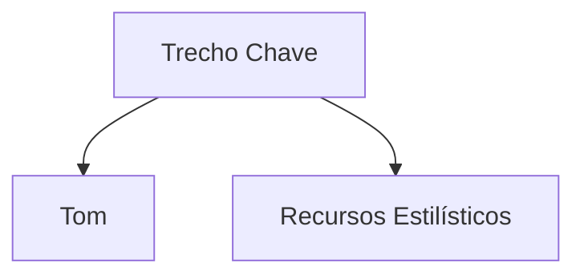

# Tarefa de Análise de Tom Filosófico

**Objetivo:** Realizar uma análise matizada do tom textual, examinando como escolhas estilísticas servem à comunicação filosófica.

**Texto:**  
{text}

## Dimensões de Análise:
1. **Marcadores Linguísticos**:
   - Complexidade da estrutura de frases
   - Densidade lexical e formalidade
   - Uso de pronomes e perspectiva

2. **Postura Retórica**:
   - Presença e posicionamento autoral
   - Estratégias de engajamento com o leitor
   - Uso de ironia, humor ou outros recursos tonais

3. **Ressonância Filosófica**:
   - Alinhamento com tons típicos da tradição filosófica
   - Tensão entre conteúdo e estilo de apresentação

## Formato de Saída Requerido:
```markdown
### Avaliação do Tom
**Tom Principal:** [Descritor]  
**Nível de Confiança:** [Alto/Médio/Baixo]  
**Indicadores Chave:**  
- [Característica 1]: [Exemplo + Explicação]  
- [Característica 2]: [Exemplo + Explicação]

### Detalhamento Estilístico
| Característica | Exemplo | Análise |
|---------------|---------|---------|
| [Característica] | [Texto] | [Impacto] |

### Implicações Filosóficas
**Alinhamento com Tradição:**  
- Como este tom reflete/complica a tradição filosófica

**Engajamento do Leitor:**  
- Efeitos esperados em:  
  - Iniciantes em filosofia: [Efeitos]  
  - Leitores acadêmicos: [Efeitos]  
  - Visões opostas: [Efeitos]

### Análise Comparativa
[Compare com tons de 2-3 obras filosóficas semelhantes]
```

**Nota:** Inclua um "Mapa de Mudanças de Tom" se houver variações significativas, marcando locais e significância filosófica das mudanças.
# Análise de Tom (Português)

## Propósito
Analisa estilo retórico e tom filosófico em textos em português.

## Variáveis do Template
- `{text}`: Texto para análise
- `{lang}`: pt
- `{options}`: Opções de análise em JSON

## Exemplo de Uso
```python
from obsidian_analyzer.prompt_loader import load_prompt

prompt = load_prompt("analyze_tone_pt", {
    "text": texto_em_portugues,
    "lang": "pt"
})
```

## Estrutura de Saída
```markdown
### Avaliação de Tom
**Tom Dominante**: [descritor]
**Características Principais**:
- [Característica]: [Exemplo] → [Análise]

### Mapa Retórico


### Recomendações
- Para Estudantes: [Dicas]
- Para Críticos: [Abordagens]
```

**Notas**:
- Foco em análise filosófica, não apenas linguística
- Considerar contexto cultural brasileiro/português
- Identificar marcas de oralidade quando presentes
