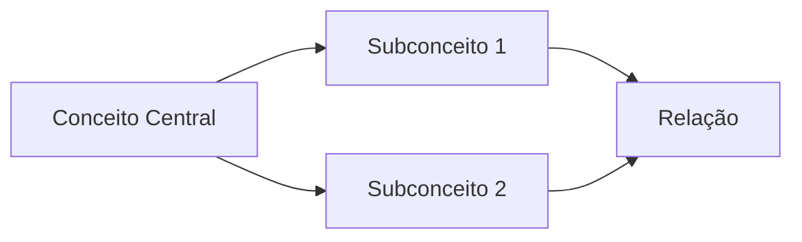

# Mapeamento Conceitual Filosófico (Aprofundado)

**Objetivo:** Identificar, analisar e contextualizar conceitos filosóficos em textos complexos.

## Texto de Entrada:
```text
{text}
```

## Metodologia:

### 1. Análise Textual
- **Identificação de Conceitos**:
  - Termos técnicos
  - Neologismos
  - Conceitos implícitos
- **Relações Intratextuais**:
  - Oposições binárias
  - Hierarquias conceituais
  - Redes de significação
- **Análise Metafórica**:
  - Metáforas estruturais
  - Analogias fundamentais
  - Domínios fonte/alvo

### 2. Análise Histórica
- **Genealogia**:
  - Origem histórica
  - Transformações semânticas
  - Autores-chave
- **Recepção**:
  - Críticas principais
  - Reformulações

### 3. Análise Sistemática
- **Consistência Interna**:
  - Coerência lógica
  - Tensões conceituais
- **Originalidade**:
  - Grau de inovação
  - Dívidas teóricas

## Formato de Saída:

```markdown
### Mapa Conceitual


### Tabela Analítica
| Conceito | Definição Operacional | Autores Referência | Críticas Relevantes |
|----------|-----------------------|--------------------|---------------------|
| [Nome] | [Definição] | [Autores] | [Críticas] |

### Análise Comparativa
**Em relação a:**
1. [Autor/Tradição]: [Semelhanças/Diferenças]
2. [Autor/Tradição]: [Semelhanças/Diferenças]

### Sugestões de Pesquisa
- **Leituras Primárias**: [2-3 obras]
- **Leituras Secundárias**: [2-3 comentários]
- **Debates Atuais**: [Tópicos relevantes]

### Glossário
**Termo**: Definição contextual
**Termo**: Definição contextual
```

**Observações**: 
1. Priorizar conceitos com maior densidade teórica
2. Indicar passagens-chave para cada conceito
3. Sinalizar ambiguidades ou polissemias
