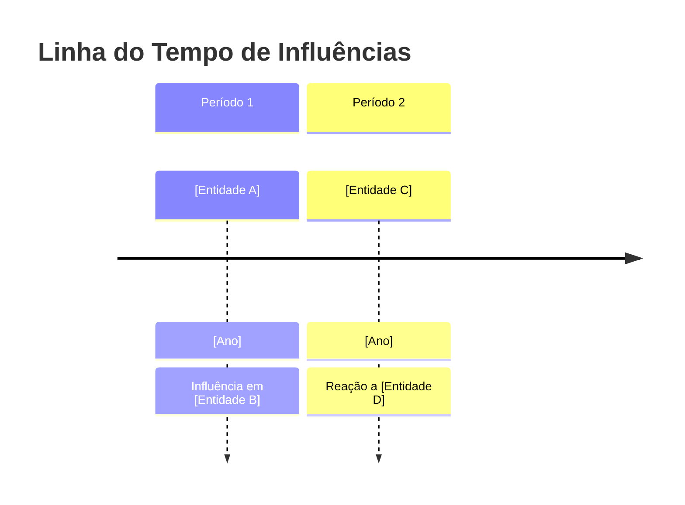

# Tarefa de Correlação de Entidades Filosóficas

**Objetivo:** Estabelecer conexões sistemáticas entre as entidades filosóficas abaixo, identificando padrões estruturais e influências recíprocas.

**Entidades:**  
{entities}

## Protocolo de Análise:
1. **Análise Diacrônica**:
   - Mapeie relações históricas com datas e contextos específicos
   - Documente influências diretas e mediações culturais

2. **Análise Sincrônica**:
   - Identifique estruturas conceituais compartilhadas
   - Compare abordagens metodológicas

3. **Análise Dialética**:
   - Destaque contradições internas e externas
   - Avalie sínteses históricas e possíveis

## Formato de Saída Requerido:
```markdown
### Mapa de Relações


### Análise Detalhada
**Correlações Estruturais:**
1. [Tipo de Relação]:
   - [Entidade X] ↔ [Entidade Y]: [Descrição]
   - Evidência: [Citações/Eventos]
   - Impacto Histórico: [Efeitos]

**Padrões Temáticos:**
- [Tema 1]:
  - Manifestações: [Lista]
  - Variações Históricas: [Descrição]
- [Tema 2]:
  - Manifestações: [Lista]
  - Variações Históricas: [Descrição]

### Tensões e Sínteses
**Dilemas Não Resolvidos:**
1. [Tensão Principal]:
   - Polos: [Entidade A] vs [Entidade B]
   - Tentativas de Mediação: [Histórico]

**Sugestões para Pesquisa Futura:**
[Áreas que merecem investigação adicional]
```

**Nota:** Inclua pelo menos 2 exemplos de como essas correlações se manifestam em textos filosóficos específicos.
