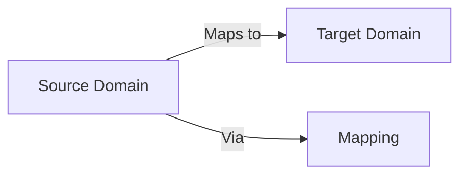

# Deep Metaphor Analysis

**Objective:** Identify and analyze metaphorical structures in philosophical texts, examining their conceptual foundations and philosophical implications.

## Input Text:
```text
{text}
```

## Analysis Framework:

### 1. Metaphor Identification
- **Surface Level**:
  - Explicit metaphorical statements
  - Extended analogies
  - Implied comparisons
- **Conceptual Level**:
  - Source domains
  - Target domains
  - Mapping completeness

### 2. Poetic Analysis
- **Sound Patterns**:
  - Alliteration/assonance
  - Rhythmic structures
- **Imagery**:
  - Visual/kinesthetic/tactile
  - Density and distribution

### 3. Philosophical Function
- **Argumentative Role**:
  - Illustration vs. foundation
  - Epistemic weight
- **Tradition Context**:
  - Novelty vs. convention
  - Intertextual references

## Output Format:

```markdown
### Key Metaphors


### Poetic Analysis
**Sound Devices**:
- [Device]: [Example] → [Effect]

**Imagery**:
- [Type]: [Example] → [Philosophical Function]

### Conceptual Mapping Table
| Source Domain | Target Domain | Mapping | Philosophical Significance |
|--------------|---------------|---------|----------------------------|
| [Source] | [Target] | [Relation] | [Impact] |

### Evaluation
**Strengths**:
- [Conceptual clarity]
- [Argumentative power]

**Limitations**:
- [Potential misdirections]
- [Unwarranted mappings]
```
